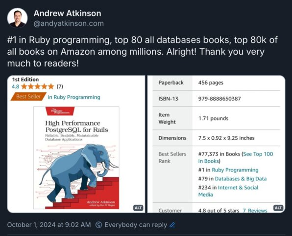
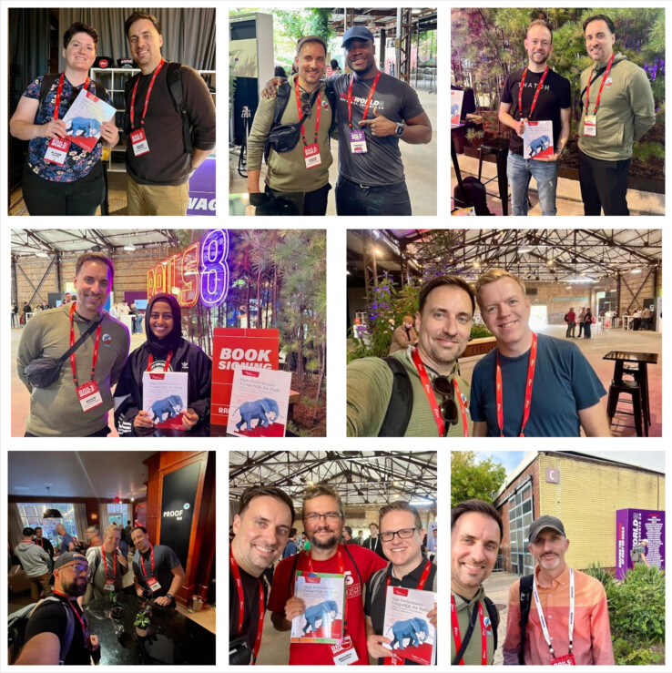
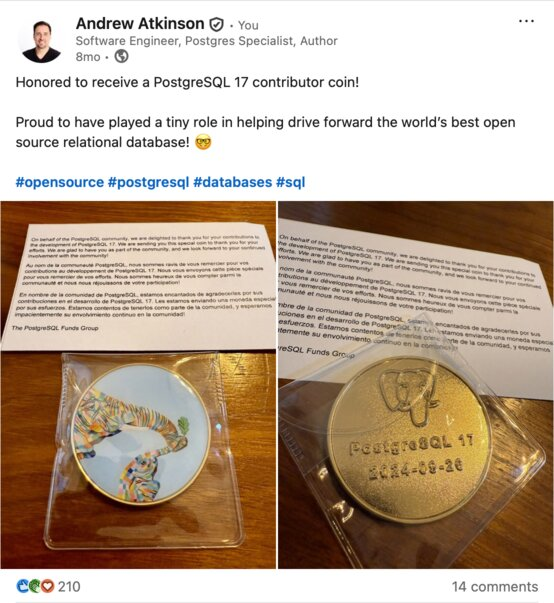

<!-- _color: #fff; -->
<!-- _backgroundColor: #fff; -->
<!-- _backgroundImage: linear-gradient(110deg, #000000 1%, #006bb6 60%, #f58330 70%); -->

<style scoped>
  section {
    padding:100px;
  }
  h1 { font-size:2.3em;}
  a { color: #fff; }
  section::after {
    color:#fff;
    }
  img.img {
    float:right;
    max-width:250px;

  }
  .stack-vertical {
    width:300px;
    float:right;
    margin:0;
    padding:0;
  }
  .stack-vertical img {
    display:block;
    margin:0;
    padding:0;   
    width:100%;
    max-width:300px;
    position:relative;
    top:-70px;
  }
  .stack-vertical .img {
    max-width:90%;
  }
  .stack-vertical .img.qr {
    max-width:100%;
    position:relative;
    left:10px;
    top:-10px;
  }
  .stack-vertical .img.rails {
    position:relative;
    left:-30px;
    top:-20px;
  }
  .stack-vertical .img.db {
    max-width:50%;
    position:relative;
    left:-80px;
    top:-60px;
  }
</style>

# Multitenancy Patterns in Community PostgreSQL

<code style="font-size:2em;">🌐 <a href="https://bit.ly/pg-mten">bit.ly/pg-mten</a></code>

<div class='opener-logo'></div>


---
<style scoped>
  section {
    background-image: var(--theme-color-3);
  }
</style>

### Inspiration for this talk: Operating lots of Postgres instances
- A dozen PostgreSQL instances serving different user segments
- A mix of multi-customer and single-customer databases
- Configuration inconsistencies: users, grants, schema objects, tables, indexes
- Over-provisioned instances had excessive spending, under-provisioned instances had performance problems

<div class='corner-label'>What if there was a better way? 🤔</div>

---
<style scoped>
  section {
    background-color:#006bb6;
  }
</style>





---
<style scoped>
  section::after {
    color:#fff;
  }
  section {
    background-color: var(--theme-color-2);
    color:#fff;
  }
</style>

### ❤️ Postgres
Received a PostgreSQL 17 Contributor Coin (2024)<sup><a href="#footnote-1-1">1</a></sup>



---
<style scoped>
  footer {
    color:#fff;
  }
  section::after {
    color:#fff;
  }
  section {
    background-color: var(--theme-color-1);
    color:#fff;
  }

</style>

## 🏢 Better Design: Multi-Tenant Database

Let's explore benefits and limitations of 6 patterns in multi-tenant database design

---

## 🚫 🏢 Benefits and drawbacks without Multi-Tenancy

✅ Compute isolation
✅ Strong data isolation
🟡 Possibly less code or schema design changes needed
🔴 Increased costs from overprovisioned instances
🔴 Complexity from managing a fleet like administration, upgrades, monitoring

---

## ✨ Opportunities with Multi-tenant DB consolidation

💵 Cost savings, greater resource efficiency
✅ Avoiding or deferring "fleet management" challenges
✅ Can achieve (weaker) forms of tenant data uniqueness and isolation
✅ Can distribute some computation work but ultimately limited by single instance

---

## 🫠 Multitenancy Challenges

🟡 Lacking native tenant primitives, need to build in more pieces using database or application-level features
🟡 Can't achieve full compute isolation
🟡 Can be limited by shared Postgres subsystems (Autovacuum, buffer cache)
🟡 Requires some upfront architecture planning or costly schema/data migrations

---
<style scoped>

  section {
    background-color:#000;
  }
  li .list-item {
    width:275px;
    font-size: 40px;
    margin:10px 0;
    padding: 0 25px;
  }
  .group-container {
      display: flex;
      align-items: stretch;
      position: relative;
      border:1px solid;
    }

    .group-label {
      writing-mode: vertical-rl;
      transform: rotate(180deg);
      background-color: #f0f0f0;
      color: #333;
      font-weight: bold;
      padding: 0.5rem;
      border-right: 1px solid #333;
      text-align: center;
    }

    .group-content {
      flex: 1;
    }
</style>

<div class="top-bar">
  <div class="active">Starting up</div>
  <div class="inactive">Learning</div>
  <div class="inactive">Optimizing</div>
</div>

<div style="display: flex; gap: 2rem;">
  <div style="flex: 1; margin: -30px px; border-radius: 5px;">
    <ul style="list-style-type:none;margin:10px 10px 10px 10px;padding:0;">
      <li><div class='list-item mistake-1'>💪 1—Single Big DB</div></li>
      <li><div class='list-item mistake-2'>🔑 2—Composite Primary Keys</div></li>
    </ul>
  </div>

  <div style="flex: 1; padding: 1rem; border-radius: 8px; list-style-type: none; color:#000;">
    <ul style="list-style-type:none;margin:10px 10px 10px 10px;padding:0;">
      <li><div class="list-item mistake-3">📄 3—Tenant Data Logs</div></li>
      <li><div class="list-item mistake-4">⚡ 4—Tenant Query Logs</div></li>
    </ul>
  </div>

  <div style="flex: 1; padding: 1rem; border-radius: 8px; list-style-type: none; color:#000;">
    <ul style="list-style-type:none; margin:10px 10px 10px 10px;padding:0;">
    <li><div class="list-item mistake-5">🔒 5—Row Level Security</div></li>
    <li><div class="list-item mistake-6">🍕 6—Partitioned Tables</div></li>
    </ul>
  </div>
</div>


---
<style scoped>
section {
  color:#fff;
  background-color: var(--theme-mistake-1);
}
a { color: #fff; }
</style>
<div class="top-bar">
  <div class="active">Starting up</div>
  <div class="inactive">Learning</div>
  <div class="inactive">Optimizing</div>
</div>

<h2>💪 1—Single Big DB: E-commerce Multitenant design</h2>

Quad single: database, schema, user, all `pgconf`, on single instance

  ⛁ `suppliers` (Our "tenant")
  ⛁ `customers`
  ⛁  `orders` (FK `supplier_id`, FK `customer_id`)

---
<style scoped>
section {
  color:#fff;
  background-color: var(--theme-mistake-1);
  background-color: #000;
}
a { color: #fff; }
section .diagram {
  font-size:25px;
  width:80%;
  position:relative;
  top:-60px;
  margin:4em;
  padding:0em;
}
</style>

<div class="diagram"><pre>
┌─────────────────────────────────────────────────────────────────┐
│                                                                 │
│     Server instance, Postgres 18, hardware resources (CPU, mem) │
│     User: "postgres" superuser, regular user "pgconf"           │
│                                                                 │
│      ┌────────────────────────────────────────────────────┐     │
│      │                                                    │     │
│      │   Database "pgconf"                                │     │
│      │                                                    │     │
│      │      ┌───────────────────────────────────────┐     │     │
│      │      │                                       │     │     │
│      │      │   Schema "pgconf"                     │     │     │
│      │      │                                       │     │     │
│      │      │  ┌────────────────┐  ┌──────────────┐ │     │     │
│      │      │  │ pgconf.        |  | pgconf.      │ │     │     │ 
|      |      │  │ customers      │  │ orders       │ │     │     │
│      │      │  │                │  │              │ │     │     │
│      │      │  │                │  │              │ │     │     │
│      │      │  │                │  │              │ │     │     │
│      │      │  └────────────────┘  └──────────────┘ │     │     │
│      │      │                                       │     │     │
│      │      └───────────────────────────────────────┘     │     │
│      │                                                    │     │
│      └────────────────────────────────────────────────────┘     │
│                                                                 │
└─────────────────────────────────────────────────────────────────┘
</pre></div>

---
<style scoped>
section {
  color:#fff;
  background-color: var(--theme-mistake-1);
}
a { color: #fff; }
</style>

## 🔑 Primary Keys Decision Point

⛁ Goldilocks PK data type: `bigint` 8 bytes. `integer` 4 bytes too small. 16 bytes UUID too big.
⛁ The `suppliers` primary key `id` is the tenant identifier
⛁ Add `supplier_id` to all tables, a form of denormalization


---
<style scoped>
section {
  color:#fff;
  background-color: var(--theme-mistake-1);
}
a { color: #fff; }
</style>

## 🔍 Tenant Data Identification

- Identify tenant data using `supplier_id` foreign key, no join needed
- Uniformity in scripts, use `generated column` on `suppliers` table to generate `supplier_id` column
- Multicolumn indexes with `(supplier_id, id)` to likely offer good performance as data grows
- Easier row data movement, copy tenant rows to other environments: staging, demo

---
<style scoped>
section {
  color:#fff;
  background-color: var(--theme-mistake-1);
}
a { color: #fff; }
</style>

# Demos

👉 `github.com / andyatkinson / presentations / pgconf2025 / README.md`
✅ Docker Postgres 18 instance
✅ `sh create_db.sh`

<div class='corner-label'>DEMO #1</div>

---
<style scoped>
section {
  color:#fff;
  background-color: var(--theme-mistake-1);
}
a { color: #fff; }
</style>
<div class="top-bar">
  <div class="active">Starting up</div>
  <div class="inactive">Learning</div>
  <div class="inactive">Optimizing</div>
</div>

<h2>1—Single Big DB: Vertically scale as long as possible</h2>

- Google Cloud PostgreSQL: 96 vCPUs, 624 GB
- Microsoft Azure: 96 vCores, 672 GB
- AWS RDS db.r8g.48xlarge, 192 vCPUs, 1536 GB (1.5 TB) memory (210K annually on-demand, 140K 1-year reservation per Vantage.sh<sup><a href="#footnote-1-4">4</a></sup>)

---
<style scoped>
section {
  color:#fff;
  background-color: var(--theme-mistake-2);
}
a { color: #fff; }
</style>
<div class="top-bar">
  <div class="active">Starting up</div>
  <div class="inactive">Learning</div>
  <div class="inactive">Optimizing</div>
</div>

<h2>🔑 2—Primary Key Alternative: Composite Primary Keys</h2>

- Improves ability to isolate or relocate data
- Active Record ORM in Ruby on Rails supports composite primary keys

🟡 Downside: Longer key definitions

```sql
  CONSTRAINT fk_customer
      FOREIGN KEY (supplier_id, id)
      REFERENCES customers (supplier_id, id)
```

<div class='corner-label'>DEMO #2</div>

---
<style scoped>
section {
  color:#fff;
  background-color: var(--theme-mistake-2);
}
a { color: #fff; }
</style>
</style>
<div class="top-bar">
  <div class="active">Starting up</div>
  <div class="inactive">Learning</div>
  <div class="inactive">Optimizing</div>
</div>

<h2>🔑 Primary Key Alternative: UUID Version 7</h2>

- Postgres 18 generates UUID Version 7 values with `uuidv7()` function<sup><a href="#footnote-1-5">5</a></sup>
- UUIDs avoid primary key conflicts when generating from multiple instances. We can also achieve that with CPKs and discrete tenant placement.

---
<style scoped>
section {
  color:#fff;
  background-color: var(--theme-mistake-3);
}
a { color: #fff; }
</style>
</style>
<div class="top-bar">
  <div class="inactive">Starting up</div>
  <div class="active">Learning</div>
  <div class="inactive">Optimizing</div>
</div>

<h2>📄 3—Tenant Data Logs</h2>

- Report on Inserts, Updates, and Deletes from suppliers
- Use cases: Usage based billing, vertical scale planning, future split outs

⛁ Table `supplier_data_changes` to capture these events

- Use triggers and trigger functions to capture changes and metadata
- Store data using JSON columns, use `JSON_TABLE()` (Postgres 17 blog post<sup><a href="#footnote-1-8">8</a></sup>)

<div class='corner-label'>DEMO #3</div>

---
<style scoped>
section {
  color:#fff;
  background-color: var(--theme-mistake-4);
}
a { color: #fff; }
</style>
<div class="top-bar">
  <div class="inactive">Starting up</div>
  <div class="active">Learning</div>
  <div class="inactive">Optimizing</div>
</div>

<h2>⚡ 4—Tenant-scoped Query Activity</h2>

Due to `pg_stat_statements` query normalization, we lose our `supplier_id`

⛁ Let's fix that with a `supplier_query_logs` table

<div class='corner-label'>DEMO #4</div>

---
<style scoped>
section {
  color:#fff;
  background-color: var(--theme-mistake-5);
}
a { color: #fff; }
</style>
<div class="top-bar">
  <div class="inactive">Starting up</div>
  <div class="inactive">Learning</div>
  <div class="active">Optimizing</div>
</div>

<h2>🔒 5—Row Level Security For Suppliers</h2>

- How do we add more security so suppliers see only their data?
- Let's use Row Level Security to achieve that

<div class='corner-label'>DEMO #5</div>

---
<style scoped>
section {
  color:#fff;
  background-color: var(--theme-mistake-6);
}
a { color: #fff; }
</style>
<div class="top-bar">
  <div class="inactive">Starting up</div>
  <div class="inactive">Learning</div>
  <div class="active">Optimizing</div>
</div>

<h2>🍕 6—Partitioned Tables</h2>

⛁ As the `orders` table grows large, it's more difficult to modify and performance worsens 
- Let's use declaractive table partitioning<sup><a href="#footnote-1-7">7</a></sup> to slice it up, maintaining good performance and making modifications easier
- Our partitioned table uses a CPK (`supplier_id`, `id`)

---
<style scoped>
section {
  color:#fff;
  background-color: var(--theme-mistake-6);
}
a { color: #fff; }
</style>
<div class="top-bar">
  <div class="inactive">Starting up</div>
  <div class="inactive">Learning</div>
  <div class="active">Optimizing</div>
</div>

## 🍕 6—Partitioning and Multi-Tenancy

⛁ Let's create a `orders_partitioned` table, using `LIST` partitioning, with a partition per supplier
- Imagine we have < 1000 suppliers

✅ Partitioned tables can be "detached" (`DETACH CONCURRENTLY`), a less resource intensive alternative to deleting unneeded rows
✅ When suppliers leave, we'll detach their partition, archive its data, then drop it

<div class='corner-label'>DEMO #6</div>

---
<style scoped>
section {
  color:#fff;
  background-color: var(--theme-mistake-5);
}
a { color: #fff; }
</style>
<div class="top-bar">
  <div class="inactive">Starting up</div>
  <div class="inactive">Learning</div>
  <div class="active">Optimizing</div>
</div>

## ⚠️ Warning #1: RLS Performance

- Familiarize yourself with RLS latency
- Dian Fay: Row level security pitfalls.<sup><a href="#footnote-1-2">2</a></sup> Compare your query execution plans without policies (and their functions) to understand how much overhead is added.

---
<style scoped>
section {
  color:#fff;
  background-color: var(--theme-mistake-3);
}
a { color: #fff; }
</style>
<div class="top-bar">
  <div class="inactive">Starting up</div>
  <div class="inactive">Learning</div>
  <div class="active">Optimizing</div>
</div>

## ⚠️ Warning #2: Trigger overhead performance

- Triggers are scalable to a point
- What is that point? Good up to 50K inserts/second? Trigger functions are one type of commit latency.
- Could mitigate with a partitioned table, minimal indexes and constraints
- Otherwise move to async approach e.g. logical replication, CDC etc. (beyond this scope)


---
<style scoped>
section {
  color:#fff;
  background-color: var(--theme-mistake-6);
}
a { color: #fff; }
</style>
<div class="top-bar">
  <div class="inactive">Starting up</div>
  <div class="inactive">Learning</div>
  <div class="active">Optimizing</div>
</div>

## ⚠️ Warnings #3: Partitioning challenges

- Requires a big row data migration vs. in-place change if starting from an unpartitioned table
- `LIST` partitioning may not work with thousands of tenants (See: *5.12.6. Best Practices for Declarative Partitioning*<sup><a href="#footnote-1-6">6</a></sup>)
- May exceed single instance limits and move to a sharded DB solution (See: *SaaS on Rails on PostgreSQL*<sup><a href="#footnote-1-3">3</a></sup>, App-level sharding, Citus)

---
<style scoped>

  .corner-label {
    position: fixed;
    bottom: 200px;
    transform: rotate(-35deg);
  }
</style>

<!-- _backgroundColor: #D7DEED; -->


<div class='corner-label'>📣 CFP Open Oct. 20</div>

---

# Let's Recap

Using open source Postgres, without managing a fleet of instances, we can:
- Avoid inconsistencies in release versions, users, permissions, schemas
- Store data from many tenants maintaining uniqueness and portability
- Report on tenant read and write activity
- Use row level security to limit access
- Split up some types of work using tenant-specific partitions


---

<!-- _color: #fff; -->
<!-- _backgroundColor: #fff; -->
<!-- _backgroundImage: linear-gradient(90deg, #000000 50%, #529FD4 50% 80%); -->

<style scoped>
section {
  font-size: 2.3em;
}
section a {
  color:#fff;
}
.qr-code {
  max-width:300px;
  width:300px;
  float:right;
  position:absolute;
  right:0px;
  top:-50px;
  padding:200px 100px 0 0;
}
.qr-code img {
  float:right;
  max-width:400px;
}
</style>

<!-- _backgroundImage: linear-gradient(110deg, #000000 1%, #006bb6 60%, #f58330 70%); -->


# 👋 Thank you!

💻 [github.com/andyatkinson/presentations](https://github.com/andyatkinson/presentations)
📚 [*High Performance PostgreSQL for Rails*](https://andyatkinson.com/pgrailsbook)
🦋 [@andyatkinson.com](https://bsky.app/profile/andyatkinson.com)

---
<style scoped>
section li, section li a { 
  color: #fff; 
  font-size:20px;
}
.footnote {
  position:relative;
  top:-50px;
}
ul {
  list-style-type:none;
  margin-left:-5px;
}
ul.two-column-list {
  column-count: 2;
  column-gap: 2rem;
  padding: 10px 0 0 0;
  list-style-position: inside;
}
section .links {
  padding:50px 0;
}
</style>

<!--
HTML is generated below from this footnotes source
{{
1-1,wiki.postgresql.org/wiki/Contributor_Gifts
1-2,di.nmfay.com/rls-performance
1-3,andyatkinson.com/blog/2024/07/13/SaaS-on-Rails-on-PostgreSQL-POSETTE-2024-andrew-atkinson
1-4,instances.vantage.sh/aws/rds/db.r8g.48xlarge?currency=USD
1-5,thenile.dev/blog/uuidv7
1-6,postgresql.org/docs/current/ddl-partitioning.html#DDL-PARTITIONING-DECLARATIVE-BEST-PRACTICES
1-7,postgresql.org/docs/current/ddl-partitioning.html
1-8,andyatkinson.com/postgresql-17-json-table-merge-returning-updatable-views
}}
-->

<div class='footnote'><ul class='two-column-list'><li id='footnote-1-1'>
  1. <a href='https://wiki.postgresql.org/wiki/Contributor_Gifts'>wiki.postgresql.org/wiki/Contributor_Gifts</a>
</li>
<li id='footnote-1-2'>
  2. <a href='https://di.nmfay.com/rls-performance'>di.nmfay.com/rls-performance</a>
</li>
<li id='footnote-1-3'>
  3. <a href='https://andyatkinson.com/blog/2024/07/13/SaaS-on-Rails-on-PostgreSQL-POSETTE-2024-andrew-atkinson'>andyatkinson.com/blog/2024/07/13/SaaS-on-Rails-on-PostgreSQL-POSETTE-2024-andrew-atkinson</a>
</li>
<li id='footnote-1-4'>
  4. <a href='https://instances.vantage.sh/aws/rds/db.r8g.48xlarge?currency=USD'>instances.vantage.sh/aws/rds/db.r8g.48xlarge?currency=USD</a>
</li>
<li id='footnote-1-5'>
  5. <a href='https://thenile.dev/blog/uuidv7'>thenile.dev/blog/uuidv7</a>
</li>
<li id='footnote-1-6'>
  6. <a href='https://postgresql.org/docs/current/ddl-partitioning.html#DDL-PARTITIONING-DECLARATIVE-BEST-PRACTICES'>postgresql.org/docs/current/ddl-partitioning.html#DDL-PARTITIONING-DECLARATIVE-BEST-PRACTICES</a>
</li>
<li id='footnote-1-7'>
  7. <a href='https://postgresql.org/docs/current/ddl-partitioning.html'>postgresql.org/docs/current/ddl-partitioning.html</a>
</li>
<li id='footnote-1-8'>
  8. <a href='https://andyatkinson.com/postgresql-17-json-table-merge-returning-updatable-views'>andyatkinson.com/postgresql-17-json-table-merge-returning-updatable-views</a>
</li>
</ul></div>