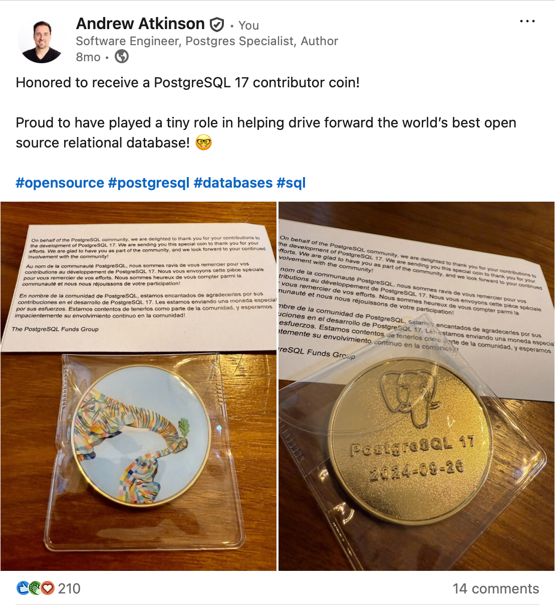

<!-- _color: #fff; -->
<!-- _backgroundColor: #fff; -->
<!-- _backgroundImage: linear-gradient(75deg, #000000 30%, #529FD4 55%, #fff 77%); -->

<style scoped>
  section {
    padding:100px;
  }
h1 { font-size:2.3em;}
a { color: #fff; }
section::after {
    color:#fff;
    }
img.img {
  float:right;
  max-width:250px;

}
.stack-vertical {
  width:300px;
  float:right;
  margin:0;
  padding:0;
}
.stack-vertical img {
  display:block;
  margin:0;
  padding:0;   
  width:100%;
  max-width:300px;
  position:relative;
  top:-70px;
}
.stack-vertical .img {
  max-width:90%;
}
.stack-vertical .img.qr {
  max-width:100%;
  position:relative;
  left:10px;
  top:-10px;
}
.stack-vertical .img.rails {
  position:relative;
  left:-30px;
  top:-20px;
}
.stack-vertical .img.db {
  max-width:50%;
  position:relative;
  left:-80px;
  top:-60px;
}
</style>


# Multitenancy Patterns in Community PostgreSQL

<code style="font-size:2em;">🌐 <a href="https://bit.ly/XXX">bit.ly/XXX</a></code>

---
<style scoped>
  img.rc17 {
    position:absolute;
    top:50px;
    right:30px;
    max-width:600px;
  }
  img.rw24 {
    position:relative;
    bottom:220px;
    left:620px;
    max-width:400px;
  }
</style>

### Was there a better architecture?
- A dozen PostgreSQL instances set up at different times without infra-as-code.
- A mix of used by multiple cusotmers or single customers
- Configuration inconsistencies. Different Postgres users, grants, schema objects, tables, and indexes.
- Most instances were over-provisioned resulting in over spending, or under-provisioned  resulting in performance problems

---
<style scoped>
  img.rw24 {
    position:relative;
    bottom:60px;
    left:620px;
    max-width:400px;
  }
</style>


---

### ❤️ Postgres
- Received a PostgreSQL 17 Contributor Coin Gift (2024)<sup><a href="#footnote-1-1">1</a></sup>



---
<style scoped>
  footer {
    color:#000;
  }
  section::after {
    color:#000;
  }
  section {
    background-color:#666;
  }
  li .list-item {
    width:275px;
    font-size: 40px;
    margin:10px 0;
    padding: 0 25px;
  }
  .group-container {
      display: flex;
      align-items: stretch;
      position: relative;
      border:1px solid;
    }

    .group-label {
      writing-mode: vertical-rl;
      transform: rotate(180deg);
      background-color: #f0f0f0;
      color: #333;
      font-weight: bold;
      padding: 0.5rem;
      border-right: 1px solid #333;
      text-align: center;
    }

    .group-content {
      flex: 1;
    }
</style>

## 🏢 Better Architecture: Multitenancy

Let's explore 6 patterns using community PostgreSQL


---

## ✨ Opportunities with Multi-tenant DB design

- Cost savings from fewer instances
- Less complexity and inconsistency
- Tenant data uniqueness and isolation
- Easier instance administration, monitoring, upgrades

---

## 🫠 Multitenancy Challenges

- Eventually limited by physical server resources (CPU, Memory, IOPS)
- Shared Postgres subsystems (Autovacuum, buffer cache)
- Lacking native tenant concept or scoping
- Requires some upfront architecture planning or migrations

---
<style scoped>
  footer {
    color:#000;
  }
  section::after {
    color:#000;
  }
  section {
    background-color:#666;
  }
  li .list-item {
    width:275px;
    font-size: 40px;
    margin:10px 0;
    padding: 0 25px;
  }
  .group-container {
      display: flex;
      align-items: stretch;
      position: relative;
      border:1px solid;
    }

    .group-label {
      writing-mode: vertical-rl;
      transform: rotate(180deg);
      background-color: #f0f0f0;
      color: #333;
      font-weight: bold;
      padding: 0.5rem;
      border-right: 1px solid #333;
      text-align: center;
    }

    .group-content {
      flex: 1;
    }
</style>

<div class="top-bar">
  <div class="active">Starting up</div>
  <div class="inactive">Learning</div>
  <div class="inactive">Optimizing</div>
</div>

<div style="display: flex; gap: 2rem;">
  <div style="flex: 1; margin: -30px px; border-radius: 5px;">
    <ul style="list-style-type:none;margin:10px 10px 10px 10px;padding:0;">
      <li><div class='list-item mistake-1'>#1 Single Big DB</div></li>
      <li><div class='list-item mistake-2'>#2 Composite Primary Keys</div></li>
    </ul>
  </div>

  <div style="flex: 1; padding: 1rem; border-radius: 8px; list-style-type: none; color:#000;">
    <ul style="list-style-type:none;margin:10px 10px 10px 10px;padding:0;">
      <li><div class="list-item mistake-3">#3 Tenant Data Logs</div></li>
      <li><div class="list-item mistake-4">#4 Tenant Query Logs</div></li>
    </ul>
  </div>

  <div style="flex: 1; padding: 1rem; border-radius: 8px; list-style-type: none; color:#000;">
    <ul style="list-style-type:none; margin:10px 10px 10px 10px;padding:0;">
    <li><div class="list-item mistake-5">#5 Row Level Security</div></li>
    <li><div class="list-item mistake-6">#6 Partitioned Orders</div></li>
    </ul>
  </div>
</div>


---
<style scoped>
section {
  color:#fff;
  background-color: var(--theme-mistake-1);
}
a { color: #fff; }
</style>
<div class="top-bar">
  <div class="active">Starting up</div>
  <div class="inactive">Learning</div>
  <div class="inactive">Optimizing</div>
</div>

<h2>💪 #1 Single Big DB: E-commerce Multitenant design</h2>

Triple single: one database `pgconf`, schema `pgconf` and instance
- Table: `suppliers` (Our "tenant")
- Table: `customers`
- Table: `orders` (FK `supplier_id`, FK `customer_id`)

🛒 Customers create orders, orders are for items from suppliers

---

```
┌─────────────────────────────────────────────────────────────────┐
│                                                                 │
│     Server instance (Postgres 18: CPUs, Memory, cache etc.)     │
│                                                                 │
│      ┌────────────────────────────────────────────────────┐     │
│      │                                                    │     │
│      │   Database "pgconf"                                │     │
│      │                                                    │     │
│      │      ┌───────────────────────────────────────┐     │     │
│      │      │                                       │     │     │
│      │      │   Schema "pgconf"                     │     │     │
│      │      │                                       │     │     │
│      │      │  ┌────────────────┐  ┌──────────────┐ │     │     │
│      │      │  │ Table          │  │ Table        │ │     │     │
│      │      │  │ customers      │  │ orders       │ │     │     │
│      │      │  │                │  │              │ │     │     │
│      │      │  │                │  │              │ │     │     │
│      │      │  │                │  │              │ │     │     │
│      │      │  └────────────────┘  └──────────────┘ │     │     │
│      │      │                                       │     │     │
│      │      └───────────────────────────────────────┘     │     │
│      │                                                    │     │
│      └────────────────────────────────────────────────────┘     │
│                                                                 │
└─────────────────────────────────────────────────────────────────┘
```

---

## 🔑 Primary Keys decision point

- Goldilocks PK data type: `bigint` 8 bytes. `integer` 4 bytes too small. 16 bytes UUID too big.
- The `suppliers` primary key `id` are our tenant
- Add `supplier_id` foreign key to all tables (a form of denormalization)


---

## 🔍 Tenant data identification

- Identify tenant data using `supplier_id` foreign key, no join needed
- Uniformity in scripts, use `generated column` on `suppliers` table to generate `supplier_id` column
- Multicolumn indexes with `(supplier_id, id)` to likely offer good performance as data grows
- Easier row data movement, copy tenant rows to other environments: staging, demo

---

# Demos

- `github.com / andyatkinson / presentations / pgconf2025 / README.md`
- Docker Postgres 18 instance
- Entrypoint script: `sh create_db.sh`

From there, we’ll look at corresponding SQL files for each pattern

---
<style scoped>
section {
  color:#fff;
  background-color: var(--theme-mistake-1);
}
a { color: #fff; }
</style>
<div class="top-bar">
  <div class="active">Starting up</div>
  <div class="inactive">Learning</div>
  <div class="inactive">Optimizing</div>
</div>

<h2>#1 Single Big DB: Vertically scale as long as possible</h2>

- Google Cloud PostgreSQL: 96 vCPUs, 624 GB
- Microsoft Azure: 96 vCores, 672 GB
- AWS RDS db.r8g.48xlarge, 192 vCPUs, 1536 GB (1.5 TB) memory (210K annually on-demand, 140K 1-year reservation per Vantage.sh<sup><a href="#footnote-1-4">4</a></sup>)

---
<style scoped>
section {
  color:#fff;
  background-color: var(--theme-mistake-1);
}
a { color: #fff; }
</style>
<div class="top-bar">
  <div class="active">Starting up</div>
  <div class="inactive">Learning</div>
  <div class="inactive">Optimizing</div>
</div>

<h2>#2 Primary Key Alternative: Composite Primary Keys</h2>

- We can choose the tenant identifier and a unique integer as the primary key
- Improves ability to isolate or relocate data
- Active Record ORM in Ruby on Rails supports composite primary keys
- Downside: Longer key definitions
```sql
  CONSTRAINT fk_customer
      FOREIGN KEY (supplier_id, id)
      REFERENCES customers (supplier_id, id)
```

DEMO

---
<style scoped>
section {
  color:#fff;
  background-color: var(--theme-mistake-1);
}
a { color: #fff; }
</style>
<div class="top-bar">
  <div class="active">Starting up</div>
  <div class="inactive">Learning</div>
  <div class="inactive">Optimizing</div>
</div>

<h2>Primary Key Alternative: UUID v7</h2>

- Postgres 18 can generate UUID V7 values natively using `uuidv7()` function<sup><a href="#footnote-1-5">5</a></sup>
- UUIDs avoid primary key conflicts when generating from multiple instances. We can also achieve that with CPKs and discrete tenant placement.

---
<style scoped>
section {
  color:#fff;
  background-color: var(--theme-mistake-1);
}
a { color: #fff; }
</style>
<div class="top-bar">
  <div class="inactive">Starting up</div>
  <div class="active">Learning</div>
  <div class="inactive">Optimizing</div>
</div>

<h2>📄 #3 Tenant Data Logs</h2>

- Let's explore a pattern to report the Inserts, Updates, and Deletes from suppliers
- Create table: `supplier_data_changes` to capture these events
- Use triggers and trigger functions to capture changes and metadata
- Store data using JSON columns

DEMO

---
<style scoped>
section {
  color:#fff;
  background-color: var(--theme-mistake-1);
}
a { color: #fff; }
</style>
<div class="top-bar">
  <div class="inactive">Starting up</div>
  <div class="active">Learning</div>
  <div class="inactive">Optimizing</div>
</div>

<h2>⚡ #4 Tenant-scoped Query Activity</h2>

- While `pg_stat_statements` (PGSS) reports our queries as groups, since normalization removes the `supplier_id` values, so we can't report on query activity by tenant
- Let's make a query logs table that's scoped to tenants

DEMO

---
<style scoped>
section {
  color:#fff;
  background-color: var(--theme-mistake-1);
}
a { color: #fff; }
</style>
<div class="top-bar">
  <div class="inactive">Starting up</div>
  <div class="inactive">Learning</div>
  <div class="active">Optimizing</div>
</div>

<h2>🔒 #5 Row Level Security For Suppliers</h2>

- How do we add more security so suppliers only see their own row data?
- Let's demo a Row Level Security Policy to limit access to supplier data

DEMO

---
<style scoped>
section {
  color:#fff;
  background-color: var(--theme-mistake-1);
}
a { color: #fff; }
</style>
<div class="top-bar">
  <div class="inactive">Starting up</div>
  <div class="inactive">Learning</div>
  <div class="active">Optimizing</div>
</div>

<h2>🍕 #6 Partitioned Tables</h2>

- As the `orders` table grows large, it's more difficult to modify and performance worsens 
- Let's use table partitioning to break it up, and keep it easier to modify and with good performance despite row growth
- Our partitioned table uses a CPK (`supplier_id`, `id`)

---
<style scoped>
section {
  color:#fff;
  background-color: var(--theme-mistake-1);
}
a { color: #fff; }
</style>
<div class="top-bar">
  <div class="inactive">Starting up</div>
  <div class="inactive">Learning</div>
  <div class="active">Optimizing</div>
</div>

## 🍕 #6 Partitioning and Multi-tenancy

- Partitioned tables can be "detached" (`DETACH CONCURRENTLY`) which is a less resource intensive way to delete rows compared with `DELETE` operations
- Let's store supplier data in their own partition, imaginging we have < 1000 suppliers
- When suppliers leave the platform, we detach their partition, archive the data, then drop the partition

DEMO

---
<style scoped>
section {
  color:#fff;
  background-color: var(--theme-mistake-1);
}
a { color: #fff; }
</style>
<div class="top-bar">
  <div class="inactive">Starting up</div>
  <div class="inactive">Learning</div>
  <div class="active">Optimizing</div>
</div>

## ⚠️ Warnings #1 of 3: RLS Performance

- RLS adds performance overhead. Dian Fay: Row level security pitfalls<sup><a href="#footnote-1-2">2</a></sup> Compare your query execution plans without policies (and their functions) to understand how much overhead is added.

---
<style scoped>
section {
  color:#fff;
  background-color: var(--theme-mistake-1);
}
a { color: #fff; }
</style>
<div class="top-bar">
  <div class="inactive">Starting up</div>
  <div class="inactive">Learning</div>
  <div class="active">Optimizing</div>
</div>

## ⚠️ Warnings #2 of 3: Trigger overhead performance

- Imagine 50K Inserts/second, trigger functions add commit latency, there's index maintenance, WAL activity, this might be a scalability problem
- Could mitigate with a partitioned table and append-mostly pattern, and minimal indexes and constraints
- Otherwise: Likely need to move to async approach e.g. logical replication, CDC etc. (beyond this scope)


---
<style scoped>
section {
  color:#fff;
  background-color: var(--theme-mistake-1);
}
a { color: #fff; }
</style>
<div class="top-bar">
  <div class="inactive">Starting up</div>
  <div class="inactive">Learning</div>
  <div class="active">Optimizing</div>
</div>

## ⚠️ Warnings #3 of 3: Partitioning challenges

- Requires a big row data migration vs. in-place change if starting from an unpartitioned table
- `LIST` partitioning may no longer be a good solution with thousands of tenants (See: *5.12.6. Best Practices for Declarative Partitioning*<sup><a href="#footnote-1-6">1</a></sup>)
- May exceed instance limits and need a sharded solution (See: *SaaS on Rails on PostgreSQL*<sup><a href="#footnote-1-3">3</a></sup>)

---
<!-- _color: #fff; -->
<!-- _backgroundColor: #fff; -->
<!-- _backgroundImage: linear-gradient(90deg, #000000 50%, #529FD4 50% 80%); -->

<style scoped>
section {
    font-size: 2em;
}
.qr-code {
  max-width:300px;
  width:300px;
  float:right;
  position:absolute;
  right:0px;
  top:-50px;
  padding:200px 100px 0 0;
}
.qr-code img {
  float:right;
  max-width:400px;
}
</style>

### 👋 Thank you!

✉️ Newsletter [pgrailsbook.com](pgrailsbook.com)
🦋 [@andyatkinson.com](https://bsky.app/profile/andyatkinson.com)
💼 Consulting [Refined Pages, LLC](refinedpages.com)

---
<style scoped>
section li, section li a { 
  color: #fff; 
  font-size:20px;
}
.footnote {
  position:relative;
  top:-50px;
}
ul {
  list-style-type:none;
  margin-left:-5px;
}
ul.two-column-list {
  column-count: 2;
  column-gap: 2rem;
  padding: 10px 0 0 0;
  list-style-position: inside;
}
</style>

<!--
HTML is generated below from this footnotes source
{{
1-1,wiki.postgresql.org/wiki/Contributor_Gifts
1-2,di.nmfay.com/rls-performance
1-3,andyatkinson.com/blog/2024/07/13/SaaS-on-Rails-on-PostgreSQL-POSETTE-2024-andrew-atkinson
1-4,instances.vantage.sh/aws/rds/db.r8g.48xlarge?currency=USD
1-5,thenile.dev/blog/uuidv7
1-6,postgresql.org/docs/current/ddl-partitioning.html#DDL-PARTITIONING-DECLARATIVE-BEST-PRACTICES
}}
-->

<div class='footnote'><ul class='two-column-list'><li id='footnote-1-1'>
  1. <a href='https://wiki.postgresql.org/wiki/Contributor_Gifts'>wiki.postgresql.org/wiki/Contributor_Gifts</a>
</li>
<li id='footnote-1-2'>
  2. <a href='https://di.nmfay.com/rls-performance'>di.nmfay.com/rls-performance</a>
</li>
</ul></div>