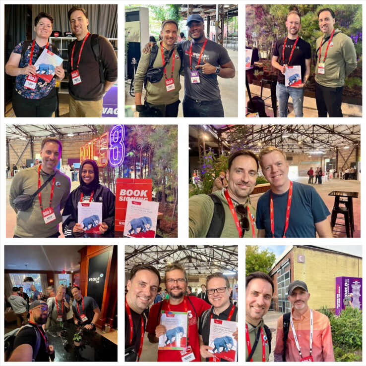
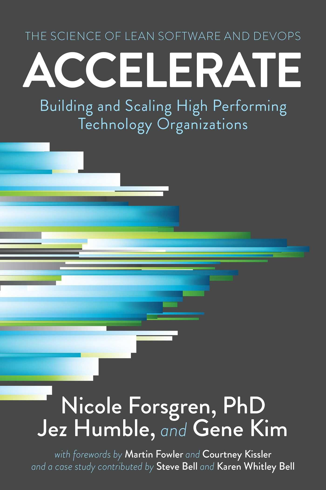
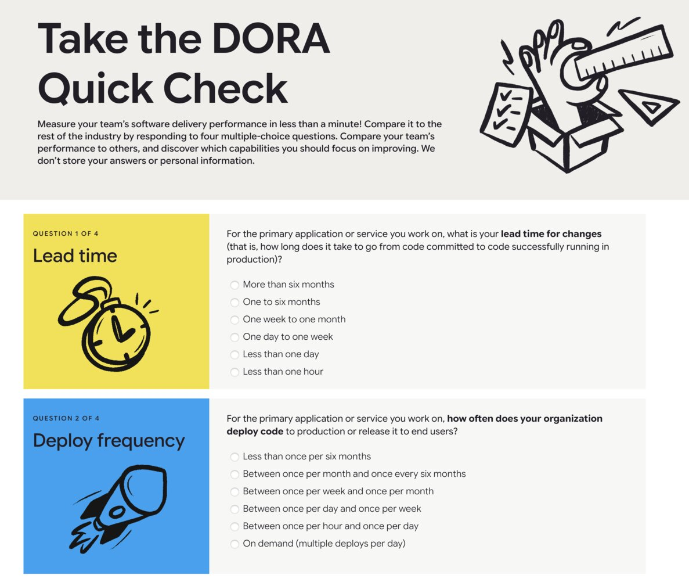
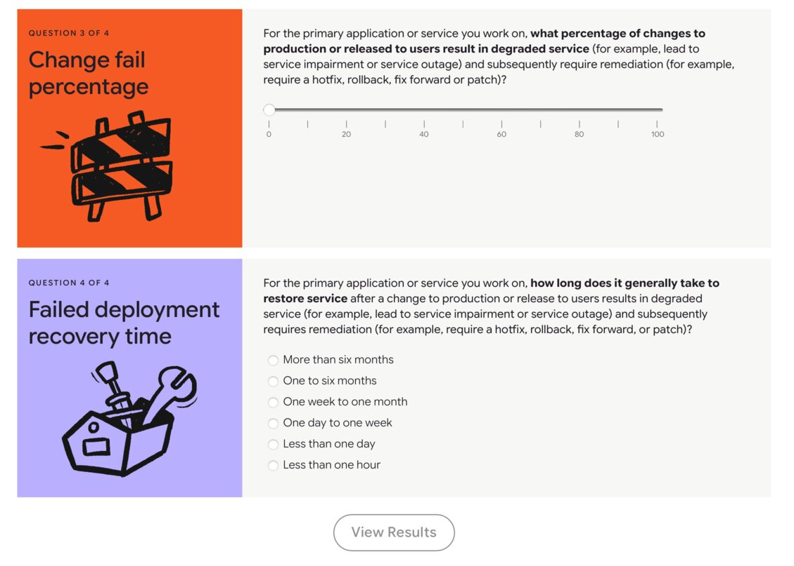
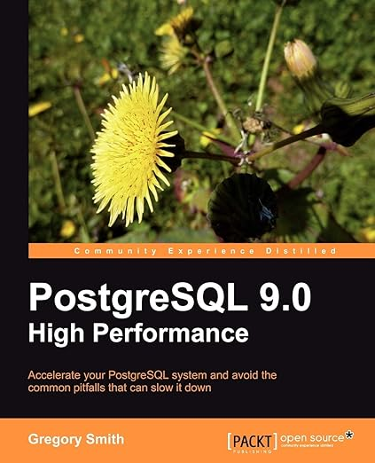
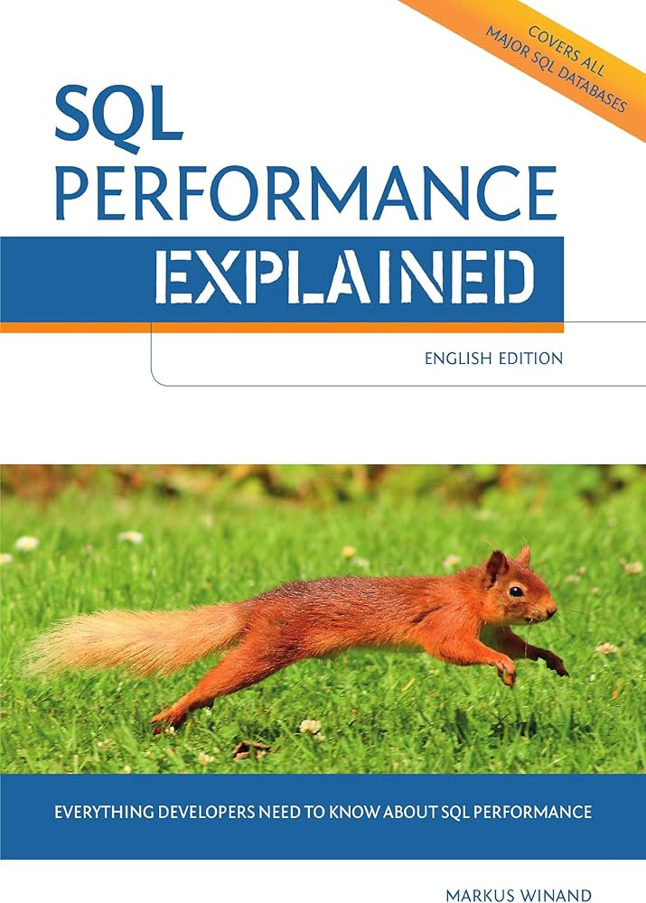
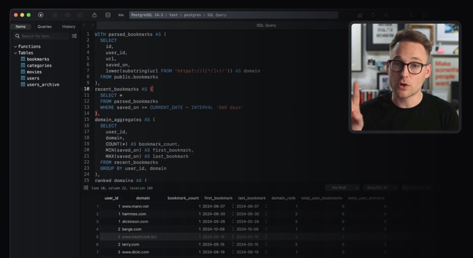
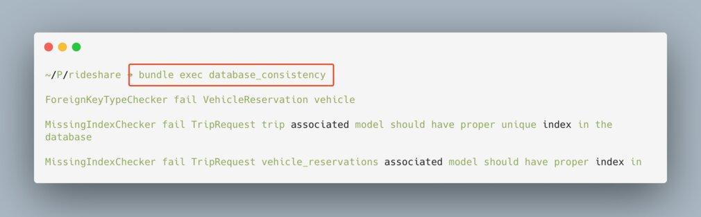

<!-- _color: #fff; -->
<!-- _backgroundColor: #fff; -->
<!-- _backgroundImage: linear-gradient(45deg, #000000 25%, #04619f 50%, #fff 67%); -->

# 10 Costly Database Performance Mistakes
## (And How To Fix Them)

---

# My Background
Ruby on Rails developer, Postgres Specialist, Author, Consultant

---

  

    <h3>Bill: Costly DB Mistakes</h3>
    
July 8, 2025

  

  <table>
    <thead>
      <tr>
        <th>Item</th>
        <th class="qty">Qty</th>
        <th class="price">Price</th>
        <th class="total">Total</th>
      </tr>
    </thead>
    <tbody>
      <tr>
        <td>Bigger server costs</td>
        <td class="qty">12</td>
        <td class="price">$500.00</td>
        <td class="total">$6,000.00</td>
      </tr>
      <tr>
        <td>Customer downgrades, churn (5K ARR)</td>
        <td class="qty">5</td>
        <td class="price">$5,000</td>
        <td class="total">$25,000.00</td>
      </tr>
    </tbody>
    <tr>
      <td>Dev time triage, resolution, 5 devs, 5 hours/month, $150/hr</td>
      <td class="qty">300</td>
      <td class="price">$150.00</td>
      <td class="total">$30,000.00</td>
    </tr>
    <tfoot>
      <tr class="dashed"><td colspan="4"></td></tr>
      <tr class="summary">
        <td colspan="3">Total</td>
        <td class="total">$61,000.00</td>
      </tr>
    </tfoot>
  </table>

🍬 Thanks for your business!

---

  
Forming

  
Scaling

  
Optimizing

  

    <ul style="list-style-type:none;margin:10px 10px 10px 10px;padding:0;">
      <li>
10. Using Gitflow
</li>
      <li>
9. DB Inexperience
</li>
      <li>
8. Speculative DB Design
</li>
      <li>
7. Missing DB Monitoring
</li>
    </ul>
  

  

    <ul style="list-style-type:none;margin:10px 10px 10px 10px;padding:0;">
      <li>
6. ORM Pitfalls
</li>
      <li>
5. DDL Fear
</li>
      <li>
4. Excessive Data Access
</li>
    </ul>
  

  

    <ul style="list-style-type:none; margin:10px 10px 10px 10px;padding:0;">
    <li>
3. Missing Data Archival</li>
    <li>
2. Missing DB Maintenance
</li>
    <li>
1. Rejecting Mechanical Sympathy
</li>
    </ul>
  

Costs 👀 are here 💵 💵 💵

---

  
Forming

  
Scaling

  
Optimizing

## ❌ Mistake #10—Using Gitflow
- Using Gitflow<a href="#footnote-60">60</a> for software delivery
- Performing DDL changes exclusively using ORM Migrations
- Not tracking DevOps metrics

💵 Cycle time, incident response

---

  
Forming

  
Scaling

  
Optimizing

<h2>❌ Mistake #10—Using Gitflow ✅ 🛠️ Fixes</h2>

- Use Trunk-based development (TBD).<a href="#footnote-61">61</a> 20% of 2024 Rails Survey<a href="#footnote-3">3</a> respondents release "a few per month"
- Track DevOps metrics. DORA<a href="#footnote-4">4</a>, SPACE<a href="#footnote-5">5</a>, *Accelerate*,<a href="#footnote-49">49</a>, 2-Minute DORA Quick Check<a href="#footnote-50">50</a>
- Raise test coverage (*Simplecov*),<a href="#footnote-18">18</a> increase test speed and reliability
- Lint ORM<a href="#footnote-20">20</a> and SQL (*squawk*<a href="#footnote-19">19</a>) migrations for safe DDL
- Enhance Rails migrations with ⚓ Anchor Migrations,<a href="#footnote-62">62</a> safety-linted, non-blocking, idempotent & consistent.<a href="#footnote-40">40</a>

---

---

  
Forming

  
Scaling

  
Optimizing

## ❌ Mistake #9—DB Inexperience

---

    
Ruby on Rails

    

## Active Record ORM
- Object-orientation, inheritance, classes, methods, Ruby code
- ORM, query generation gems. Abstraction, reusability, portability.

  

🔄 Object–relational mismatch<a href="#footnote-52">52</a>

    
Database

    

## Relational Database
- Data. Storage and retrieval. SQL, relations, indexes, execution plans, normalization, caches
- Pages, buffers, locks, MVCC & bloat in PostgreSQL

  

---

  
Forming

  
Scaling

  
Optimizing

## ❌ Mistake #9—DB Inexperience

- Not hiring DB specialists or DBAs
- Generating AI solutions but not being able to verify them
- Not using SQL in application code or business intelligence
- Not able to read and interpret query execution plans
- Limited understanding of *cardinality*, *selectivity*, or how to use `BUFFERS`
- Adding indexes haphazardly (over-indexing)<a href="#footnote-6">6</a>
- Choosing schema designs with poor performance

💵 Server costs, Developer time

---

  
Forming

  
Scaling

  
Optimizing

<h2>❌ Mistake #9—DB Inexperience ✅ 🛠️ Fixes</h2>

- Gain experience through hiring: DB specialists, DBAs, and consultants
- Invest in training materials like books and courses.
- Provide a production-like database instance for experiments, and encourage engineers to use it
- Learn fundamental concepts like *pages*, latency sources, *selectivity*, *cardinality*, *correlation*, and *locality* to improve designs
- Avoid performance-unfriendly schema designs like random UUID<a href="#footnote-8">8</a> primary keys

---

## Tuples & MVCC
Which Spiderman is the live tuple?

---

## Fixed-size 8KB Pages
How do I fit all my data into these small boxes?

---

---

## [Mastering Postgres](masteringpostgres.com)

## [High Performance SQLite](highperformancesqlite.com)

## [Scaling Postgres](scalingpostgres.com/courses/)

---

  
Forming

  
Scaling

  
Optimizing

## ❌ Mistake #8—Speculative DB Design
- Avoiding beneficial database constraints due to speculation about the future
- Casting doubt about the ability to evolve the schema design
- *Not* using data normalization practices by default, avoiding duplication
- Avoiding *all* denormalization, even for cases like multi-tenancy<a href="#footnote-55">55</a>

💵 Data bugs, high maintenance costs

---

  
Forming

  
Scaling

  
Optimizing

<h2>❌ Mistake #8—Speculative DB Design ✅ 🛠️ Fixes</h2>

- Use all available constraints for data consistency, integrity, quality (CORE: *constraint-driven*<a href="#footnote-53">53</a>)
- Create matching DB constraints for code validation. Match PK/FK types.<a href="#footnote-7">7</a>
- Normalize by default. Design for today, but anticipate growth in data and query volume.
- Use denormalization sometimes, for example with multi-tenancy.

---

<small>database_consistency gem</small>

---

  
Forming

  
Scaling

  
Optimizing

## ❌ Mistake #7—Missing DB Monitoring
- Not logging slow queries or collecting query statistics and execution plans
- Not using the `BUFFERS` information in PostgreSQL execution plans
- Spending time finding looking up application source code locations for SQL queries
- Not monitoring critical background processes like Autovacuum

💵 Triage, incident resolution

---

  
Forming

  
Scaling

  
Optimizing

<h2>❌ Mistake #7—Missing DB Monitoring ✅ 🛠️ Fixes</h2>

- Log and store SQL query generation source code line numbers,<a href="#footnote-16">16</a> prefer *SQLCommenter*
- Collect query execution plans, manually or automatically with *auto_explain*<a href="#footnote-41">41</a>
- Review `BUFFERS` counts from execution plans<a href="#footnote-42">42</a> to improve designs
- Add DB observability. Postgres: *pg_stat_statements*, *PgHero*, *PgAnalyze*, *PgBadger*
- MySQL: *Percona Monitoring and Management (PMM)*, *Oracle Enterprise Manager for MySQL*<a href="#footnote-43">43</a>, SQLite: *SQLite Database Analyzer*<a href="#footnote-44">44</a>

---

  
Forming

  
Scaling

  
Optimizing

## ❌ Mistake #6—ORM Pitfalls
- Allowing inefficient queries that are ORM generated
- Never restricting column access, always using `SELECT *`<a href="#footnote-11">11</a>
- Using non-scalable query patterns like huge `IN` lists<a href="#footnote-12">12</a>
- Not removing unnecessary `COUNT(*)`, `ORDER BY` queries from ORM defaults
- Using ORM `LIMIT` / `OFFSET` pagination over alternatives
- Not using ORM *counter caches* or the *prepared statement* cache

💵 Overprovisioned, inefficient queries

---

  
Forming

  
Scaling

  
Optimizing

<h2>❌ Mistake #6—ORM Pitfalls ✅ 🛠️ Fixes</h2>

- Put your app on a SQL Query Diet<a href="#footnote-10">10</a> (find sources<a href="#footnote-20">20</a>)
- Load only needed columns: `select()`, `pluck()`, for better use of indexes
- Refactor huge `IN`<a href="#footnote-31">31</a> lists. Use a join, `VALUES`, or `ANY`+`ARRAY` (Postgres)
- Use endless (*keyset*) pagination (*pagy gem*<a href="#footnote-54">54</a>) over ORM `LIMIT`/`OFFSET`
- Use the ORM prepared statement cache<a href="#footnote-13">13</a> to skip repeated parsing/planning
- Skip unnecessary count queries with a *counter cache*<a href="#footnote-17">17</a>
- Use `size()` over `count()` and `length()`
- Use `EXISTS`<a href="#footnote-14">14</a>, control `implicit_order_column`<a href="#footnote-58">58</a>

---

  
Forming

  
Scaling

  
Optimizing

## ❌ Mistake #5—DDL Fear
- Creating code workarounds to avoid schema evolution and data backfills
- No safety linting for DDL migrations
- Not using a production-like instance for practice big DDL changes
- Not using safety timeouts for Postgres, MySQL, SQLite
- Not learning the underlying locking mechanisms, or safer, multi-step alternatives

💵 Longer cycles, maintainability

---

  
Forming

  
Scaling

  
Optimizing

<h2>❌ Mistake #5—DDL Fear ✅ 🛠️ Fixes</h2>

- Practice DDL changes on a production-like instance. Collect timing. Study lock behavior.
- Use multi-step safe alternatives. `ignored_columns`,<a href="#footnote-22">22</a>. `INVALID` `CHECK` constraint before `NOT NULL`
- Lint DDL in Active Record (PostgreSQL) *strong_migrations*<a href="#footnote-25">25</a> (MySQL/MariaDB) *online_migrations*<a href="#footnote-21">21</a>, *Squawk*<a href="#footnote-24">24</a> for SQL
- Learn lock types for operations, tables, rows using `pglocks.org`
- Use a low `lock_timeout` for DDL changes with retries

---

## ❌ Mistake #4—Excessive Data Access

🔲 8 grocery bags in 1 trip
🔲 2 trips of 4 bags each

---

  
Forming

  
Scaling

  
Optimizing

## ❌ Mistake #4—Excessive Data Access
- Operating in huge sets of 10K+ rows, causing seconds of wait time for users
- Ineffective filtering and indexing on *low cardinality* columns
- Missing indexes for *high cardinality* filter columns, foreign keys
- Not using advanced indexing like multicolumn or partial (Postgres)
- Using only default B-Tree indexes, not other types like GIN, GiST
- Performing slow aggregate queries (`SUM`, `COUNT`) on huge tables
- For huge tables of 100GB or more in size, avoiding partitioning

💵 Server costs, user experience

---

  
Forming

  
Scaling

  
Optimizing

<h2>❌ Mistake #4—Excessive Data Access ✅ 🛠️ Fixes</h2>

- Work on small sets of data.<a href="#footnote-25">25</a> Restructure queries to select fewer rows, columns, and perform fewer joins.
- Create "missing indexes"<a href="#footnote-23">23</a> on high cardinality columns<a href="#footnote-24">24</a>
- Use advanced indexing like multicolumn, partial indexes, GIN, GiST.
- Improve UX by pre-calculating aggregates with *rollup*<a href="#footnote-26">26</a>, or with materialized views of denormalize data, managed with *scenic*<a href="#footnote-27">27</a>
- Migrate time-based data into a partitioned table<a href="#footnote-28">28</a> for improved performance and maintenance

---

  
Forming

  
Scaling

  
Optimizing

## ❌ Mistake #3—Missing Data Archival
- Storing a significant proportion of data in tables and indexes that's never queried
- Using high growth data gems like *public_activity*,<a href="#footnote-29">29</a> *papertrail*,<a href="#footnote-30">30</a> *audited*,<a href="#footnote-42">42</a> or *ahoy*<a href="#footnote-32">32</a>, and not archiving data
- Not archiving app data from churned customers, retired features, or soft deleted rows
- Performing resource-intensive massive `DELETE` operations

💵 Server costs, user experience

---

  
Forming

  
Scaling

  
Optimizing

<h2>❌ Mistake #3—Missing Data Archival ✅ 🛠️ Fixes</h2>

- Archive **ALL** data that's not regularly queried!
- Shrink a table using *copy swap drop*<a href="#footnote-34">34</a>
- Use partition-friendly gems like *logidze gem*<a href="#footnote-35">35</a> or partition your big tables, making necessary Rails compatibility changes<a href="#footnote-51">51</a>
- Archive app data from churned customers, soft deleted rows, and retired features (discover with *Coverband*),<a href="#footnote-33">33</a>)
- Replace massive `DELETE` operations by using time-partitioned tables, and efficient `DETACH CONCURRENTLY`

---

  
Forming

  
Scaling

  
Optimizing

## ❌ Mistake #2—Missing DB Maintenance
- Running unsupported versions of Postgres, MySQL, or SQLite
- Keeping unneeded tables, columns, constraints, indexes, functions, triggers, or extensions in your database
- Not monitoring or fixing heavily fragmented tables and indexes
- Leaving Autovacuum and other maintenance parameters untuned

💵 Poor performance, security risk, UX

---

  
Forming

  
Scaling

  
Optimizing

<h2>❌ Mistake #2—Missing DB Maintenance ✅ 🛠️ Fixes</h2>

- Upgrade your database. Postgres *why upgrade*?<a href="#footnote-37">37</a>
- *Prune and Tune* indexes,<a href="#footnote-38">38</a> use *pg_dba*<a href="#footnote-39">39</a> for psql, *rails_best_practices gem*
- Drop unneeded tables, columns, constraints, indexes, functions, triggers, and extensions
- Rebuild fragmented tables (pg_repack, pg_squeeze,<a href="#footnote-63">63</a> `VACUUM FULL`, logical replication, or *copy swap drop*<a href="#footnote-50">50</a>)
- Reindex fragmented indexes (`REINDEX CONCURRENTLY`)
- Maintain your database like your application code. *Maintainable...Databases?* podcast<a href="#footnote-36">36</a>

---

  
Forming

  
Scaling

  
Optimizing

## *Mechanical Sympathy*
> *Mechanical sympathy is when you use a tool or system with an understanding of how it operates best.*<a href="#footnote-56">56</a>

---

  
Forming

  
Scaling

  
Optimizing

## ❌ Mistake #1—Rejecting Mechanical Sympathy
- Excessive CPU and memory use from inefficient long queries. ORM or query generation libraries. *jsonapi-resources*,<a href="#footnote-45">45</a> *graphql-ruby*,<a href="#footnote-46">46</a>, *ActiveAdmin*<a href="#footnote-47">47</a>
- Excessive resource use from short queries, lazy loading and N+1s
- Not auto-cancelling excessively long queries, idle transactions, or schema migrations
- In Postgres, using designs that don't well with immutable row versions (tuples), MVCC, and Autovacuum

💵 ALL the costs

---

  
Forming

  
Scaling

  
Optimizing

<h2>❌ Mistake #1—Rejecting Mechanical Sympathy ✅ 🛠️ Fixes</h2>

- Take control of your SQL (`to_sql()`) and execution plans (`.explain()`).
- Improve efficiency, reduce the use of CPU, memory, and data access.
- Avoid high update churn designs, replacing in-place updates with "append-mostly", e.g. *slotted counters.<a href="#footnote-59">59</a>* Increase *HOT updates*.<a href="#footnote-57">57</a>
- Prevent lazy loading by using *Strict Loading*<a href="#footnote-48">48</a> partially or globally
- Add system resiliency by auto-cancelling long running queries, idle transactions, or runaway schema migrations.

---

## 🌱 ***Cultivate*** Mechanical Sympathy
> When you understand how a system is designed to be used, you can align with the design to gain optimal performance.

🏎️ 🌬️

---

### 👋 Thank you!

💼 Consulting [Refined Pages, LLC](refinedpages.com)
✍️ Blog [andyatkinson.com](andyatkinson.com)
✉️ Newsletter [pgrailsbook.com](pgrailsbook.com)

---

<!--
HTML is generated below from this footnotes source
{{
1,railsdeveloper.com/survey/2024/#databases
2,db-engines.com/en/ranking
3,railsdeveloper.com/survey/2024/#deployment-devops
4,dora.dev/guides/dora-metrics-four-keys
5,octopus.com/devops/metrics/space-framework
6,postgres.fm/episodes/over-indexing
7,github.com/djezzzl/database_consistency
8,andyatkinson.com/generating-short-alphanumeric-public-id-postgres
10,andyatkinson.com/tip-track-sql-queries-quantity-ruby-rails-postgresql
11,andyatkinson.com/blog/2024/05/28/top-5-postgresql-surprises-from-rails-developers#4-enumerating-columns-vs-select
12,andyatkinson.com/big-problems-big-in-clauses-postgresql-ruby-on-rails
13,flexport.engineering/avoiding-activerecord-preparedstatementcacheexpired-errors-4499a4f961cf
14,depesz.com/2024/12/01/sql-best-practices-dont-compare-count-with-0
15,ibm.com/history/relational-database
16,andyatkinson.com/source-code-line-numbers-ruby-on-rails-marginalia-query-logs
17,blog.appsignal.com/2018/06/19/activerecords-counter-cache.html
18,github.com/simplecov-ruby/simplecov
19,github.com/sbdchd/squawk
20,github.com/ankane/strong_migrations
21,github.com/fatkodima/online_migrations?tab=readme-ov-file#comparison-to-strong_migrations
22,andycroll.com/ruby/safely-remove-a-column-field-from-active-record/
23,github.com/andyatkinson/pg_scripts/blob/main/find_missing_indexes.sql
24,github.com/andyatkinson/pg_scripts/pull/19
25,github.com/andyatkinson/pg_scripts/pull/18
26,github.com/andyatkinson/rideshare/pull/232
27,github.com/scenic-views/scenic
28,andyatkinson.com/blog/2023/07/27/partitioning-growing-practice
29,github.com/public-activity/public_activity
30,github.com/paper-trail-gem/paper_trail
31,github.com/collectiveidea/audited
32,github.com/ankane/ahoy
33,github.com/danmayer/coverband
34,andyatkinson.com/copy-swap-drop-postgres-table-shrink
35,github.com/palkan/logidze
36,maintainable.fm/episodes/andrew-atkinson-maintainable-databases
37,why-upgrade.depesz.com
38,andyatkinson.com/blog/2021/07/30/postgresql-index-maintenance
39,github.com/NikolayS/postgres_dba
40,github.com/andyatkinson/rideshare/pull/230
41,postgresql.org/docs/current/auto-explain.html
42,postgres.ai/blog/20220106-explain-analyze-needs-buffers-to-improve-the-postgres-query-optimization-process
43,mysql.com/products/enterprise/em.html
44,sqlite.org/sqlanalyze.html
45,github.com/cerebris/jsonapi-resources
46,github.com/rmosolgo/graphql-ruby
47,github.com/activeadmin/activeadmin
48,andyatkinson.com/blog/2022/10/07/pgsqlphriday-2-truths-lie
49,a.co/d/0Sk81B9
50,dora.dev/quickcheck
51,github.com/andyatkinson/presentations/tree/main/pass2024
52,en.wikipedia.org/wiki/Object–relational_impedance_mismatch
53,andyatkinson.com/constraint-driven-optimized-responsive-efficient-core-db-design
54,ddnexus.github.io/pagy/docs/api/keyset/
55,andyatkinson.com/blog/2023/08/17/postgresql-sfpug-table-partitioning-presentation
56,wa.aws.amazon.com/wellarchitected/2020-07-02T19-33-23/wat.concept.mechanical-sympathy.en.html
57,cybertec-postgresql.com/en/hot-updates-in-postgresql-for-better-performance
58,bigbinary.com/blog/rails-6-adds-implicit_order_column
59,github.com/andyatkinson/rideshare/pull/233
60,atlassian.com/git/tutorials/comparing-workflows/gitflow-workflow
61,atlassian.com/continuous-delivery/continuous-integration/trunk-based-development
62,github.com/andyatkinson/anchor_migrations
63,cybertec-postgresql.com/en/products/pg_squeeze/
}}
-->

<ul class='two-column-list'><li id='footnote-1'>
  1. <a href='https://railsdeveloper.com/survey/2024/#databases'>railsdeveloper.com/survey/2024/#databases</a>
</li>
<li id='footnote-2'>
  2. <a href='https://db-engines.com/en/ranking'>db-engines.com/en/ranking</a>
</li>
<li id='footnote-3'>
  3. <a href='https://railsdeveloper.com/survey/2024/#deployment-devops'>railsdeveloper.com/survey/2024/#deployment-devops</a>
</li>
<li id='footnote-4'>
  4. <a href='https://dora.dev/guides/dora-metrics-four-keys'>dora.dev/guides/dora-metrics-four-keys</a>
</li>
<li id='footnote-5'>
  5. <a href='https://octopus.com/devops/metrics/space-framework'>octopus.com/devops/metrics/space-framework</a>
</li>
<li id='footnote-6'>
  6. <a href='https://postgres.fm/episodes/over-indexing'>postgres.fm/episodes/over-indexing</a>
</li>
<li id='footnote-7'>
  7. <a href='https://github.com/djezzzl/database_consistency'>github.com/djezzzl/database_consistency</a>
</li>
<li id='footnote-8'>
  8. <a href='https://andyatkinson.com/generating-short-alphanumeric-public-id-postgres'>andyatkinson.com/generating-short-alphanumeric-public-id-postgres</a>
</li>
<li id='footnote-10'>
  10. <a href='https://andyatkinson.com/tip-track-sql-queries-quantity-ruby-rails-postgresql'>andyatkinson.com/tip-track-sql-queries-quantity-ruby-rails-postgresql</a>
</li>
<li id='footnote-11'>
  11. <a href='https://andyatkinson.com/blog/2024/05/28/top-5-postgresql-surprises-from-rails-developers#4-enumerating-columns-vs-select'>andyatkinson.com/blog/2024/05/28/top-5-postgresql-surprises-from-rails-developers#4-enumerating-columns-vs-select</a>
</li>
<li id='footnote-12'>
  12. <a href='https://andyatkinson.com/big-problems-big-in-clauses-postgresql-ruby-on-rails'>andyatkinson.com/big-problems-big-in-clauses-postgresql-ruby-on-rails</a>
</li>
<li id='footnote-13'>
  13. <a href='https://flexport.engineering/avoiding-activerecord-preparedstatementcacheexpired-errors-4499a4f961cf'>flexport.engineering/avoiding-activerecord-preparedstatementcacheexpired-errors-4499a4f961cf</a>
</li>
<li id='footnote-14'>
  14. <a href='https://depesz.com/2024/12/01/sql-best-practices-dont-compare-count-with-0'>depesz.com/2024/12/01/sql-best-practices-dont-compare-count-with-0</a>
</li>
<li id='footnote-15'>
  15. <a href='https://ibm.com/history/relational-database'>ibm.com/history/relational-database</a>
</li>
<li id='footnote-16'>
  16. <a href='https://andyatkinson.com/source-code-line-numbers-ruby-on-rails-marginalia-query-logs'>andyatkinson.com/source-code-line-numbers-ruby-on-rails-marginalia-query-logs</a>
</li>
<li id='footnote-17'>
  17. <a href='https://blog.appsignal.com/2018/06/19/activerecords-counter-cache.html'>blog.appsignal.com/2018/06/19/activerecords-counter-cache.html</a>
</li>
<li id='footnote-18'>
  18. <a href='https://github.com/simplecov-ruby/simplecov'>github.com/simplecov-ruby/simplecov</a>
</li>
<li id='footnote-19'>
  19. <a href='https://github.com/sbdchd/squawk'>github.com/sbdchd/squawk</a>
</li>
<li id='footnote-20'>
  20. <a href='https://github.com/ankane/strong_migrations'>github.com/ankane/strong_migrations</a>
</li>
<li id='footnote-21'>
  21. <a href='https://github.com/fatkodima/online_migrations?tab=readme-ov-file#comparison-to-strong_migrations'>github.com/fatkodima/online_migrations?tab=readme-ov-file#comparison-to-strong_migrations</a>
</li>
<li id='footnote-22'>
  22. <a href='https://andycroll.com/ruby/safely-remove-a-column-field-from-active-record/'>andycroll.com/ruby/safely-remove-a-column-field-from-active-record/</a>
</li>
<li id='footnote-23'>
  23. <a href='https://github.com/andyatkinson/pg_scripts/blob/main/find_missing_indexes.sql'>github.com/andyatkinson/pg_scripts/blob/main/find_missing_indexes.sql</a>
</li>
<li id='footnote-24'>
  24. <a href='https://github.com/andyatkinson/pg_scripts/pull/19'>github.com/andyatkinson/pg_scripts/pull/19</a>
</li>
<li id='footnote-25'>
  25. <a href='https://github.com/andyatkinson/pg_scripts/pull/18'>github.com/andyatkinson/pg_scripts/pull/18</a>
</li>
<li id='footnote-26'>
  26. <a href='https://github.com/andyatkinson/rideshare/pull/232'>github.com/andyatkinson/rideshare/pull/232</a>
</li>
<li id='footnote-27'>
  27. <a href='https://github.com/scenic-views/scenic'>github.com/scenic-views/scenic</a>
</li>
<li id='footnote-28'>
  28. <a href='https://andyatkinson.com/blog/2023/07/27/partitioning-growing-practice'>andyatkinson.com/blog/2023/07/27/partitioning-growing-practice</a>
</li>
<li id='footnote-29'>
  29. <a href='https://github.com/public-activity/public_activity'>github.com/public-activity/public_activity</a>
</li>
<li id='footnote-30'>
  30. <a href='https://github.com/paper-trail-gem/paper_trail'>github.com/paper-trail-gem/paper_trail</a>
</li>
<li id='footnote-31'>
  31. <a href='https://github.com/collectiveidea/audited'>github.com/collectiveidea/audited</a>
</li>
<li id='footnote-32'>
  32. <a href='https://github.com/ankane/ahoy'>github.com/ankane/ahoy</a>
</li>
<li id='footnote-33'>
  33. <a href='https://github.com/danmayer/coverband'>github.com/danmayer/coverband</a>
</li>
<li id='footnote-34'>
  34. <a href='https://andyatkinson.com/copy-swap-drop-postgres-table-shrink'>andyatkinson.com/copy-swap-drop-postgres-table-shrink</a>
</li>
<li id='footnote-35'>
  35. <a href='https://github.com/palkan/logidze'>github.com/palkan/logidze</a>
</li>
<li id='footnote-36'>
  36. <a href='https://maintainable.fm/episodes/andrew-atkinson-maintainable-databases'>maintainable.fm/episodes/andrew-atkinson-maintainable-databases</a>
</li>
<li id='footnote-37'>
  37. <a href='https://why-upgrade.depesz.com'>why-upgrade.depesz.com</a>
</li>
<li id='footnote-38'>
  38. <a href='https://andyatkinson.com/blog/2021/07/30/postgresql-index-maintenance'>andyatkinson.com/blog/2021/07/30/postgresql-index-maintenance</a>
</li>
<li id='footnote-39'>
  39. <a href='https://github.com/NikolayS/postgres_dba'>github.com/NikolayS/postgres_dba</a>
</li>
<li id='footnote-40'>
  40. <a href='https://github.com/andyatkinson/rideshare/pull/230'>github.com/andyatkinson/rideshare/pull/230</a>
</li>
<li id='footnote-41'>
  41. <a href='https://postgresql.org/docs/current/auto-explain.html'>postgresql.org/docs/current/auto-explain.html</a>
</li>
<li id='footnote-42'>
  42. <a href='https://postgres.ai/blog/20220106-explain-analyze-needs-buffers-to-improve-the-postgres-query-optimization-process'>postgres.ai/blog/20220106-explain-analyze-needs-buffers-to-improve-the-postgres-query-optimization-process</a>
</li>
<li id='footnote-43'>
  43. <a href='https://mysql.com/products/enterprise/em.html'>mysql.com/products/enterprise/em.html</a>
</li>
<li id='footnote-44'>
  44. <a href='https://sqlite.org/sqlanalyze.html'>sqlite.org/sqlanalyze.html</a>
</li>
<li id='footnote-45'>
  45. <a href='https://github.com/cerebris/jsonapi-resources'>github.com/cerebris/jsonapi-resources</a>
</li>
<li id='footnote-46'>
  46. <a href='https://github.com/rmosolgo/graphql-ruby'>github.com/rmosolgo/graphql-ruby</a>
</li>
<li id='footnote-47'>
  47. <a href='https://github.com/activeadmin/activeadmin'>github.com/activeadmin/activeadmin</a>
</li>
<li id='footnote-48'>
  48. <a href='https://andyatkinson.com/blog/2022/10/07/pgsqlphriday-2-truths-lie'>andyatkinson.com/blog/2022/10/07/pgsqlphriday-2-truths-lie</a>
</li>
<li id='footnote-49'>
  49. <a href='https://a.co/d/0Sk81B9'>a.co/d/0Sk81B9</a>
</li>
<li id='footnote-50'>
  50. <a href='https://dora.dev/quickcheck'>dora.dev/quickcheck</a>
</li>
<li id='footnote-51'>
  51. <a href='https://github.com/andyatkinson/presentations/tree/main/pass2024'>github.com/andyatkinson/presentations/tree/main/pass2024</a>
</li>
<li id='footnote-52'>
  52. <a href='https://en.wikipedia.org/wiki/Object–relational_impedance_mismatch'>en.wikipedia.org/wiki/Object–relational_impedance_mismatch</a>
</li>
<li id='footnote-53'>
  53. <a href='https://andyatkinson.com/constraint-driven-optimized-responsive-efficient-core-db-design'>andyatkinson.com/constraint-driven-optimized-responsive-efficient-core-db-design</a>
</li>
<li id='footnote-54'>
  54. <a href='https://ddnexus.github.io/pagy/docs/api/keyset/'>ddnexus.github.io/pagy/docs/api/keyset/</a>
</li>
<li id='footnote-55'>
  55. <a href='https://andyatkinson.com/blog/2023/08/17/postgresql-sfpug-table-partitioning-presentation'>andyatkinson.com/blog/2023/08/17/postgresql-sfpug-table-partitioning-presentation</a>
</li>
<li id='footnote-56'>
  56. <a href='https://wa.aws.amazon.com/wellarchitected/2020-07-02T19-33-23/wat.concept.mechanical-sympathy.en.html'>wa.aws.amazon.com/wellarchitected/2020-07-02T19-33-23/wat.concept.mechanical-sympathy.en.html</a>
</li>
<li id='footnote-57'>
  57. <a href='https://cybertec-postgresql.com/en/hot-updates-in-postgresql-for-better-performance'>cybertec-postgresql.com/en/hot-updates-in-postgresql-for-better-performance</a>
</li>
<li id='footnote-58'>
  58. <a href='https://bigbinary.com/blog/rails-6-adds-implicit_order_column'>bigbinary.com/blog/rails-6-adds-implicit_order_column</a>
</li>
<li id='footnote-59'>
  59. <a href='https://github.com/andyatkinson/rideshare/pull/233'>github.com/andyatkinson/rideshare/pull/233</a>
</li>
<li id='footnote-60'>
  60. <a href='https://atlassian.com/git/tutorials/comparing-workflows/gitflow-workflow'>atlassian.com/git/tutorials/comparing-workflows/gitflow-workflow</a>
</li>
<li id='footnote-61'>
  61. <a href='https://atlassian.com/continuous-delivery/continuous-integration/trunk-based-development'>atlassian.com/continuous-delivery/continuous-integration/trunk-based-development</a>
</li>
<li id='footnote-62'>
  62. <a href='https://github.com/andyatkinson/anchor_migrations'>github.com/andyatkinson/anchor_migrations</a>
</li>
<li id='footnote-63'>
  63. <a href='https://cybertec-postgresql.com/en/products/pg_squeeze/'>cybertec-postgresql.com/en/products/pg_squeeze/</a>
</li>
</ul>

